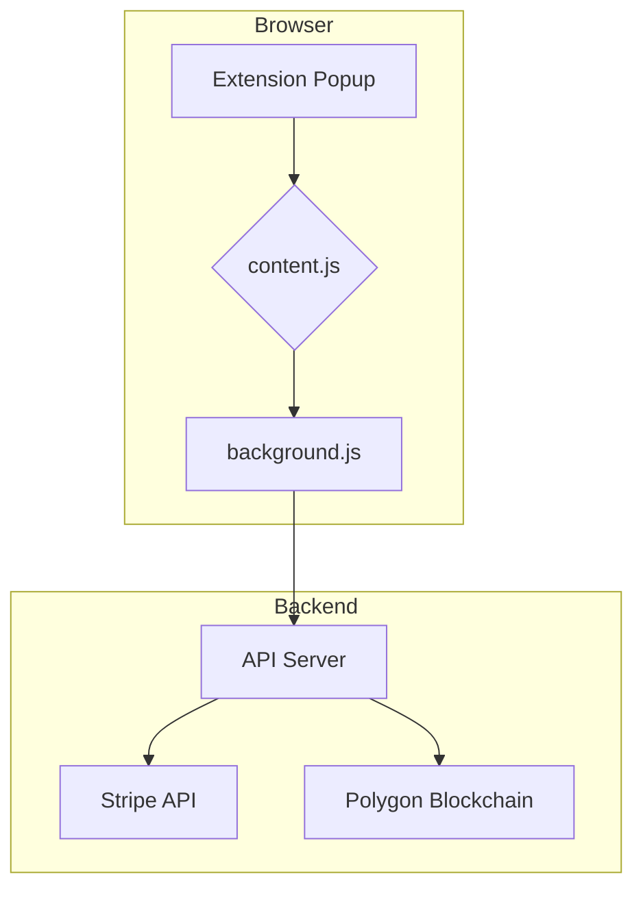

# Workflow Test and Analysis

This document outlines the plan for a complete workflow test of the FinSec-Integrated project. The goal is to ensure all components of the application work together as expected, from the browser extension to the backend services.

## 1. Project Overview

- **Backend:** Node.js application responsible for handling business logic, interacting with the database, and processing payments.
- **Extension:** Browser extension that provides a user interface for interacting with the application.
- **Smart Contracts:** Solidity contracts for handling decentralized aspects of the application.

## 2. Testing Plan

- **Static Analysis:** Review key configuration files to understand the project setup and dependencies.
- **Architectural Mapping:** Create a visual representation of the system architecture to identify key integration points.
- **Workflow Simulation:** Define and execute end-to-end test cases that simulate user interactions.
- **Deployment Verification:** Ensure the deployment process is working correctly and the application is accessible.

## 3. Key Files for Review

- `backend/.env`: Check for required environment variables.
- `backend/package.json`: Review backend dependencies.
- `extension/manifest.json`: Analyze extension permissions and configuration.
- `extension/package.json`: Review frontend dependencies.

## 4. Test Cases

- **User Authentication:** Verify that users can securely log in and access protected routes.
- **Payment Processing:** Test the complete payment workflow, from initiation to confirmation.
- **Smart Contract Interaction:** Ensure the backend can successfully interact with the deployed smart contracts.

### Test Case 1: Successful Payment

- **Objective:** Verify that a user can successfully complete a payment from the extension.
- **Steps:**
  1. Open the extension on a supported merchant website.
  2. Initiate a payment and approve the transaction.
  3. Verify that the payment is processed by Stripe and confirmed on the blockchain.
  4. Check for a success notification in the extension.

### Test Case 2: Payment Failure

- **Objective:** Ensure that the system gracefully handles payment failures.
- **Steps:**
  1. Initiate a payment with invalid payment details.
  2. Verify that the payment is rejected by Stripe.
  3. Check for an appropriate error message in the extension.

### Test Case 3: Insufficient Funds

- **Objective:** Test the workflow for payments with insufficient funds.
- **Steps:**
  1. Initiate a payment for an amount exceeding the available balance.
  2. Verify that the smart contract rejects the transaction.
  3. Check for a clear "insufficient funds" error in the extension.
